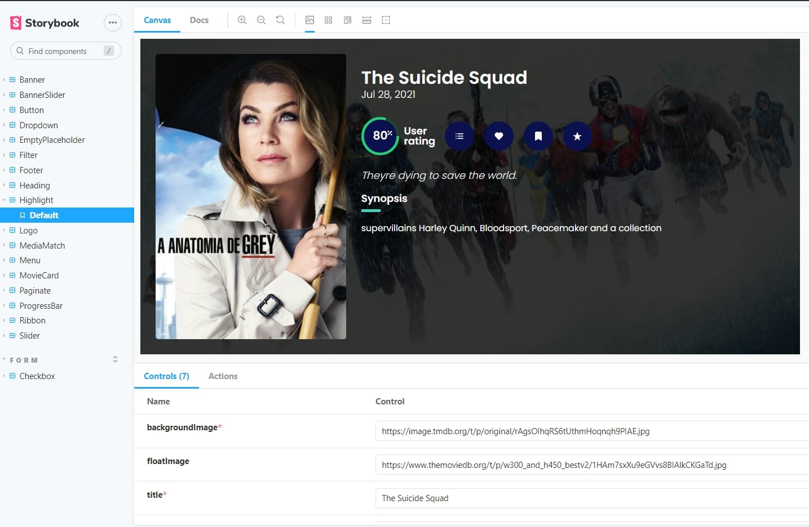
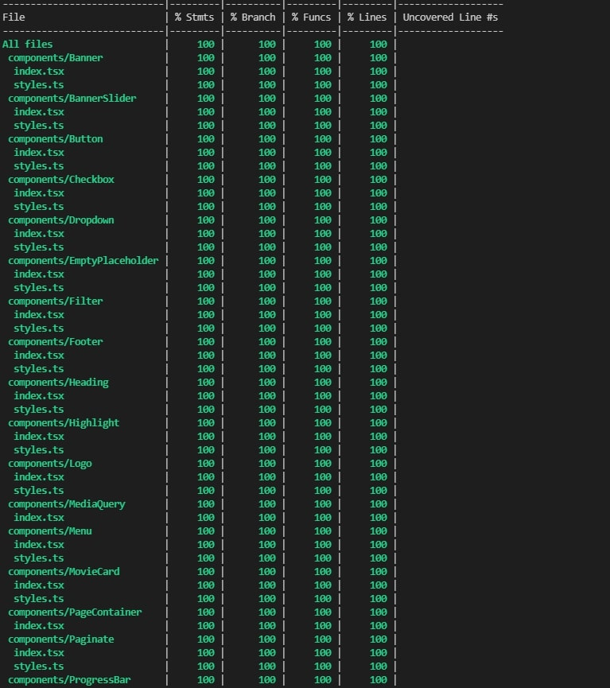

# PROMO MOVIES

This is a [Next.js](https://nextjs.org/) application. 
This is a two-page film site, one listing the films (and you can filter them by genre) and another page dedicated to each film, containing more information.

## What is inside?

### [Live Site](https://promo-movie.netlify.app/?page=1)


This project uses lot of stuff as:


[](https://github.com/styled-components/styled-components)


[](https://github.com/prettier/prettier)

- [TypeScript](https://www.typescriptlang.org/)
- [NextJS](https://nextjs.org/)
- [Styled Components](https://styled-components.com/)
- [Jest](https://jestjs.io/)
- [React Testing Library](https://testing-library.com/docs/react-testing-library/intro)
- [Storybook](https://storybook.js.org/)
- [Eslint](https://eslint.org/)
- [Prettier](https://prettier.io/)

## Getting Started

First, clone this repo 

```bash
git clone git@github.com:mvmmarcus/promo-movies.git
```

Then, install all project dependencies 

```bash
yarn 
# or
npm install
```

Don't forget to add the movie api key in .env file

```
API_KEY =
```

Run the development server:

```bash
yarn dev
# or
npm run dev
```

Open [http://localhost:3000](http://localhost:3000) with your browser to see the result.


This is a hybrid application, using ```getStaticProps``` and ```getServerSideProps``` Nextjs methods to provide the best user experience

## Test the components on Storybook

Run the command below to view all the components properties of this application 

```
yarn storybook
```



## All components are protected by testing

Run the command below to execute all tests

```
yarn test
```



## Commands

- `dev`: runs your application on `localhost:3000`
- `build`: creates the production build version
- `start`: starts a simple server with the build production code
- `lint`: runs the linter in all components and pages
- `test`: runs jest to test all components and pages
- `test:watch`: runs jest in watch mode
- `storybook`: runs storybook on `localhost:6006`
- `build-storybook`: create the build version of storybook
- `generate`: create the base components files

## 👨‍💻 Developer

<table id="contribuicoes" >
  <tr>
    <td align="center"><a href="https://www.linkedin.com/in/mvmmarcus/"><br /><sub><b>Marcus Vinícius</b></sub></a><br /><a href="https://gitlab.com/mvmmarcus" title="Marcus Vinicius">👨‍🚀</a></td>
  </tr>
</table>

Developed with ❤️ by <a href="https://www.linkedin.com/in/mvmmarcus/">Marcus Vinícius</a>

